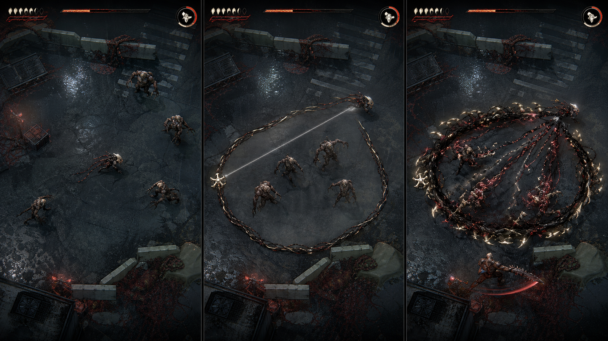

# FLESHLOOM 작업 인수인계

마지막 갱신: 2026-08-13

기준 브랜치: `main`

기준 기능 커밋: `305cf79` (`feat: rebuild the living capture tether`)

이 문서는 다른 컴퓨터, 새 Codex 세션, Claude Code처럼 기존 대화 기록이
없는 작업자가 FLESHLOOM을 같은 방향으로 이어가기 위한 시작점이다. 세부
규칙의 원본은 각 설계 문서이며, 이 문서는 현재 위치와 다음 순서를 연결한다.

## 1. 프로젝트 한 문장

FLESHLOOM은 비에 젖은 격리 도시에서 기생 사냥꾼 Carrier-09를 움직여
살아 있는 고리를 짜고, 그 고리를 닫는 행위만으로 감염체를 포획·분해하는
10–12분 탑다운 액션 로그라이트다.

일반 공격 버튼은 없다. 이동이 기회를 만들고, 닻에서 풀려 나온 생체 실을
움직이며 배치한 뒤 봉합하는 순간만 공격이 된다.

## 2. 완성 목표 이미지



원본: `references/generated/loop-gameplay-styleframe-v1.png` (1672×941)

이 이미지는 최종 자산을 그대로 복사하기 위한 시안이 아니라 다음 항목의
승인된 완성 기준이다.

- 낮은 3/4 탑다운 카메라와 넓게 읽히는 사냥 공간
- 젖은 아스팔트와 차가운 빗속 도시의 밀도
- 검은 생체량, 절제된 동맥색, 상아 골편의 명확한 비율
- Carrier-09, 적, 활성 고리, 포획 영역이 즉시 구분되는 명도 구조
- 가느다란 UI 선이 아니라 무게와 장력을 가진 살아 있는 고리
- 폐쇄 → 수축 → 분해 → 흡수가 한 번의 결정적인 포식 동작으로 읽히는 연출

완료 판정은 한 장의 스크린샷 유사도만으로 내리지 않는다. 실제 이동,
고리 변형, 적 텔레그래프, 선택 UI, Warden, 결과 화면까지 같은 작품으로
느껴져야 하며 게임 규칙과 가독성을 유지해야 한다. 보호된 캐릭터·로고·UI·
정확한 실루엣이나 구도를 복제하면 안 된다.

## 3. 반드시 먼저 읽을 문서

작업 전 아래 순서를 지킨다.

1. `AGENTS.md` — 저장소 전체의 구속력 있는 작업 규칙
2. `docs/GAME_DESIGN.md` — 잠긴 조작·포획·성장 규칙
3. `docs/VISUAL_BIBLE.md` — 목표 이미지 해석과 금지 경계
4. `docs/ARCHITECTURE.md` — 시뮬레이션/표현 계층과 의존 방향
5. `docs/MILESTONES.md` — 전체 게임 흐름과 제출 범위
6. `docs/PRODUCTION_PLAN.md` — P0–P7 구현 기록과 현재 다음 단계
7. `docs/DECISIONS.md` — 이미 끝난 논의를 다시 뒤집지 않기 위한 기록
8. 이 문서의 나머지 부분과 `docs/QA_CHECKLIST.md`

문서와 코드가 충돌하면 임의로 맞추지 말고 작업을 멈춘 뒤 충돌을
명시한다. 행동을 바꾸는 결정은 `docs/DECISIONS.md`, 작업 결과는
`docs/CODEX_COLLABORATION.md`에 기록한다.

## 4. 다른 컴퓨터에서 시작하기

요구 환경:

- Git
- Node.js `24.16.0` 권장
- 지원 범위: Node.js `^20.19.0 || >=22.12.0`
- npm과 WebGL을 지원하는 최신 Chrome 또는 Edge

```bash
git clone https://github.com/wjdgnsdl213/Fleshloom.git
cd Fleshloom
git switch main
git pull --ff-only origin main
npm ci
npm run release:verify
npm run dev
```

개발 서버가 출력한 로컬 주소를 브라우저에서 연다. 실제 릴리스 확인은
개발 서버가 아니라 아래 정적 프리뷰를 사용한다.

```bash
npm run build
npx vite preview --host 127.0.0.1 --port 4173
```

런타임에 API 키, 서버, 데이터베이스, 외부 CDN은 필요하지 않다. 필요한
아트와 오디오는 Git의 `public/`에 포함되어 있다. `node_modules/`, `dist/`,
`coverage/`는 생성물이므로 커밋하지 않는다.

첫 확인에서 반드시 남길 것:

```bash
git status -sb
git log -3 --oneline --decorate
npm run release:verify
```

정상 기준은 깨끗한 `main...origin/main`, 전체 검사 통과, 시작 아트 6MiB
이하다. 마지막 기록값은 46개 테스트 파일/376개 테스트, 시작 아트
4.61MiB다.

## 5. 현재 구현된 것

- 타이틀 → 튜토리얼 → 9분 일반 사냥 → Warden → 엔딩/결과 → 재시작 흐름
- 키보드와 터치가 같은 `InputIntent`를 만드는 입력 계층
- Toggle 기본 고리와 Hold 접근성 대안, 동일한 스냅/폐쇄 규칙
- Drifter, Rusher, Watcher, Cutter, Mimic, Elite Husk와 중장갑 Drifter
- XP 레벨업, 11개 영구 변이, 4개 임프린트, Fourfold Hunt Apex
- 3,200×1,800 유한 격리구역, 추적 카메라, 화면 밖 스폰, Warden 아레나
- 한국어 튜토리얼·선택·HUD·보스 목표·결과 화면
- 프로덕션 캐릭터/적 자산, 거리 기반 보행 시트, 살아 있는 반복 테더
- 포획 폐쇄·수축·분해·흡수 VFX/SFX, 외피 파괴 전용 피드백
- 모션 감소, 섬광 감소, 마스터/음악/SFX 음량 옵션
- 정적 배포와 하위 경로를 검사하는 `npm run release:verify`

가장 최근 P7-2에서는 편조된 흑적색 테더, 월드 거리 기반 갈고리 간격,
수축 중 편조 유지, 포획체의 방사형 조직 당김을 구현했다. 최대 256포인트
경로의 순수 테더 계산은 약 0.07ms이며, 반복 WebP는 좌우 경계 연속성과
SHA-256을 릴리스 검사에서 고정한다.

## 6. 지금 어디서부터 시작하는가

현재 작업 트리는 **P7-8 2.5D/3D 정합 패스**까지 구현되어 있다. Carrier와
모든 일반·후반 적 계열은 화면 좌상단 고정광 8방향 프리렌더를 사용하며,
Warden은 비회전 대형 본체와 접지 그림자·반사·단계별 해부학 약점을 사용한다.
배우와 환경 소품은 발 접점 Y로 가림 순서를 공유하고 모든 소품은 표현 전용이다.

실제 Chrome 포인터 플레이로 1920×1080 포획 전 단계를 검증했고 P7-6
독립 재감사에서 폐쇄 구분, 세 갈래 흡수, 3단계 환경 깊이가 모두 GO를
받았다. 변이·임프린트·Warden 도착/팔/외피/핵·승리 결과와 7개 적 갤러리도
1920×1080에서 캡처했고, 선택/결과는 390×844에서도 잘림이 없다. 증거는
`references/qa/2026-08-13-p7-{6,7,8}-*`에 있다.

다음 순서:

1. 실제 Android/iOS coarse-pointer 기기에서 양손 이동+LOOP 시작→활성
   tether→두 번째 LOOP closure, 브라우저 스크롤 차단을 연속 검증한다.
2. Chrome/Edge 전체 10–12분 사망·승리 경로와 Web Audio를 검증한다.
3. 공개/백업 URL에 현재 `dist/`를 배포하고 시크릿·새로고침 스모크 테스트를
   수행한다.

D-023~D-026의 카메라 줌, 접지광, 표현 전용 볼륨, 방향 프리렌더/깊이
정렬을 되돌리지 않는다. 특히 깊이를 이유로 소품 충돌이나 포획 판정을
변경하면 안 된다. 8방향 frame blending과 실제 mesh self-occlusion은 향후
표현 개선 항목이지 잠긴 게임 규칙 변경 사유가 아니다.

## 7. 절대 바꾸지 말아야 할 핵심 규칙

- 방향 입력은 언제나 Carrier를 움직인다. 고리를 여는 동안 정지시키지 않는다.
- 기본 고리 입력은 첫 입력에 닻, 두 번째 입력에 봉합하는 Toggle이다.
- Hold/Release는 같은 판정을 쓰는 접근성 대안이다.
- 일반 공격을 추가하지 않는다. 유효한 살아 있는 고리만 치명적이다.
- 새 임프린트는 자동 교체하지 않고 플레이어가 유지/교체를 선택한다.
- XP 변이는 한 판 동안의 영구 성장이고 흡수 이력이 선택을 강제하지 않는다.
- Fourfold Hunt는 후반 Apex이며 기본 조작 방식이 아니다.
- 초반 일반 Drifter는 한 번에 죽고, 중장갑/Elite/Warden만 명시적 단계 포획을 쓴다.

## 8. 코드 지도

| 위치 | 책임 |
| --- | --- |
| `src/app/GameApp.ts` | 장면 생명주기와 시스템 조합 |
| `src/input/` | 키보드·포인터·터치 → `InputIntent` |
| `src/core/geometry/` | Pixi와 독립적인 벡터·선분·폴리곤 계산 |
| `src/game/loop/` | 닻, 궤적, 폐쇄, 투영, 포획 공격 기하 |
| `src/game/enemies/` | 적 행동과 단계별 포획 상태 |
| `src/game/progression/` | XP, 임프린트, 변이 선택 |
| `src/game/run/`, `src/game/waves/` | 런 상태와 시간 기반 웨이브 |
| `src/content/` | 적·웨이브·변이·월드 배치 데이터 |
| `src/presentation/LoopPlaygroundRenderer.ts` | Pixi 월드/배우/VFX 렌더링 |
| `src/presentation/AssetManifest.ts` | 배포 base를 고려한 아트 로딩 계획 |
| `src/audio/` | Web Audio 음악과 SFX 라우팅 |
| `src/style.css` | DOM HUD·선택·옵션·터치 레이아웃 |
| `tests/unit/`, `tests/integration/` | 순수 규칙과 전체 흐름 회귀 |

시뮬레이션은 Pixi 객체를 import하지 않는다. 표현 계층은 포획 여부, 피해,
XP, 업그레이드 결과를 결정하지 않는다.

## 9. 알려진 위험과 수동 게이트

- Chrome 1920×1080 실제 포획과 390×844 포인터 에뮬레이션은 기록되었다. Edge 1366×768과 실제 휴대폰 coarse-pointer는 미검수다.
- Web Audio 자동 시작, 채널 음량, 피크 왜곡은 실제 장치 확인이 필요하다.
- 승리와 사망의 전체 10–12분 경로를 실제 브라우저에서 완주해야 한다.
- 공개 URL, 백업 URL, 로그아웃/시크릿 새로고침 검증이 남아 있다.
- 스크린샷만 보고 시뮬레이션 규칙을 바꾸는 것이 가장 큰 회귀 위험이다.

정확한 체크박스는 `docs/QA_CHECKLIST.md`를 사용한다.

## 10. 새 AI 세션에 전달할 시작 프롬프트

아래 문장을 그대로 새 Codex 또는 Claude Code 세션에 전달할 수 있다.

```text
이 저장소의 AGENTS.md와 CLAUDE.md, docs/HANDOFF.md를 먼저 전부 읽고,
HANDOFF의 필수 문서 순서대로 현재 규칙과 상태를 확인해줘. git status와
최근 커밋, npm run release:verify 결과를 먼저 확인한 뒤 P7-5 이후 대표 화면
정합 작업을 이어가줘. references/generated/loop-gameplay-styleframe-v1.png를
카메라·재질·명암·고리 가독성의 완성 목표로 사용하되 보호된 요소를
복제하지 말고, 잠긴 입력/포획/성장 규칙은 바꾸지 마. 이미 검증된 방향별
배우·발 위치 깊이 정렬·대형 소품·실제 포획 6단계는 보존하고, 변이/임프린트
선택과 Warden/승리 화면, 실제 모바일에서 가장 큰 차이부터 수정해줘.
완료 전 npm run release:verify, 수동 플레이, 문서 갱신, 독립 커밋과
origin/main 푸시까지 수행해줘.
```
